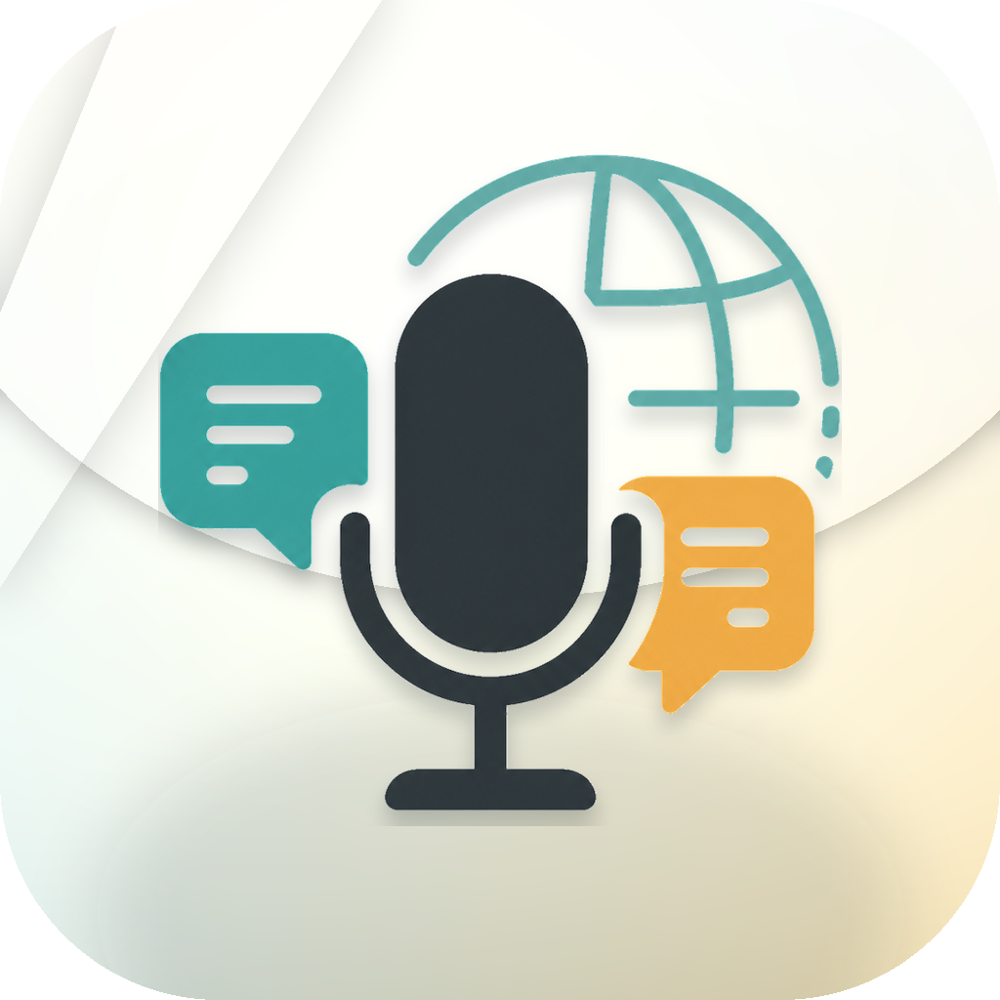
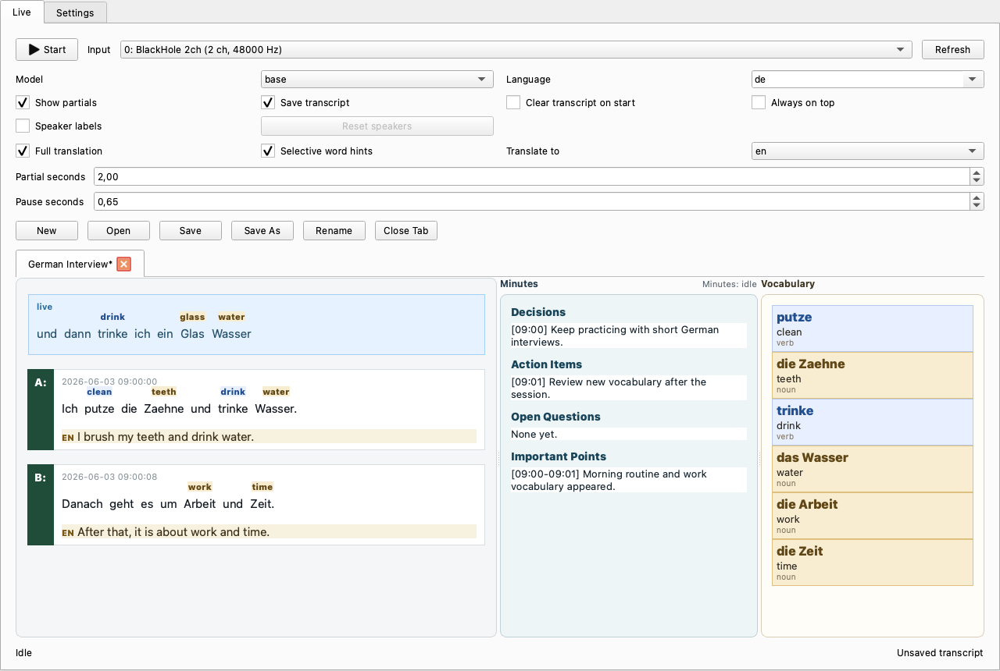
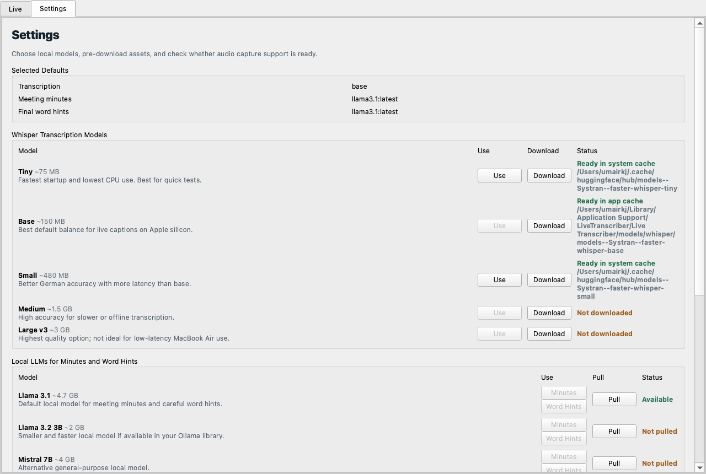

# Live Transcriber

<p align="center">
  
</p>

<p align="center">
  Local live transcription for macOS, built for following real speech in another language.
</p>

Live Transcriber listens to a microphone or virtual audio device, turns speech into a running transcript, adds helpful English translations, and saves conversations you can come back to later. It is designed for local use on macOS, with special care for German learning, YouTube audio, meetings, and interviews.

## What It Does

- Captures audio continuously so Whisper can process speech without stopping the recorder.
- Shows fast live partials while someone is still speaking.
- Saves cleaner finalized transcript lines after pauses.
- Adds full English translations for finalized lines.
- Adds noun and verb word hints above German words.
- Builds a vocabulary list as new words appear.
- Optionally labels speakers as `A`, `B`, `C`.
- Uses local Ollama models for meeting minutes.
- Saves and loads tabbed `.trans` transcript files.

## Screenshots

### Live Transcript Workspace



### Settings And Model Setup



## Quick Setup

The easiest path is the setup script:

```bash
chmod +x setup.sh
./setup.sh
```

The setup script can:

- install Homebrew system dependencies
- create the Python virtual environment
- install Python requirements
- optionally install BlackHole 2ch for Mac system audio
- optionally install the German spaCy model
- optionally build the German-English dictionary
- optionally download a Whisper model

Then launch the desktop app:

```bash
venv/bin/python ui_app.py
```

In the app:

1. Open the `Settings` tab.
2. Download or confirm a Whisper model, usually `base` first.
3. Pull an Ollama model if you want meeting minutes or richer word hints.
4. Install spaCy and build the dictionary for better live word hints.
5. Return to `Live`, choose an input device, and press `Start`.

## Manual Setup

Use this if you prefer to install pieces yourself:

```bash
brew install portaudio ffmpeg
brew install python@3.13

/opt/homebrew/opt/python@3.13/bin/python3.13 -m venv venv
source venv/bin/activate
venv/bin/python -m pip install -r requirements.txt
```

Launch the UI:

```bash
venv/bin/python ui_app.py
```

List audio inputs:

```bash
venv/bin/python app.py --list-devices
```

## Capturing Mac System Audio

For YouTube, podcasts, meetings, or any audio playing on your Mac, use BlackHole 2ch.

Install it:

```bash
brew install --cask blackhole-2ch
```

Then:

1. Open `Audio MIDI Setup`.
2. Create a `Multi-Output Device`.
3. Add your speakers or headphones and `BlackHole 2ch`.
4. Set macOS system output to the Multi-Output Device.
5. In Live Transcriber, choose `BlackHole 2ch` as the input.

If BlackHole does not appear, restart the audio app or restart your Mac.

## Recommended Models

For live transcription:

- `tiny`: fastest, lowest quality
- `base`: best first choice for low latency
- `small`: better German accuracy, more latency
- `medium` and `large-v3`: higher quality, usually slower than you want for live use

For local LLM features:

- `llama3.1:latest`: default for meeting minutes and careful finalized word hints
- `llama3.2:3b`: smaller and faster if available in your Ollama library
- `mistral:7b`: useful alternative local model

Settings shows Whisper as ready if a model is usable from either the app-managed cache or the normal Hugging Face cache. That means a model can work even if it was downloaded before this app had its own Settings tab.

## Optional Local Helpers

Better German word hints:

```bash
venv/bin/python -m pip install spacy
venv/bin/python -m spacy download de_core_news_sm
venv/bin/python scripts/build_dictionary.py
```

Ollama minutes:

```bash
ollama pull llama3.1
ollama serve
```

Optional speaker labels:

```bash
venv/bin/python -m pip install speechbrain torch torchaudio
```

## CLI Usage

The desktop UI is the friendliest way to use the app, but the CLI is still useful for testing.

Default input:

```bash
venv/bin/python app.py --model base --language de
```

Specific device:

```bash
venv/bin/python app.py --device <DEVICE_ID> --model base --language de
```

Lower latency live partials:

```bash
venv/bin/python app.py --device <BLACKHOLE_ID> --model base --language de --beam-size 1
```

Disable partials:

```bash
venv/bin/python app.py --model base --language de --partial-seconds 0
```

Add translation and word hints:

```bash
venv/bin/python app.py --model base --language de --full-translation --selective-translation
```

Enable speaker labels:

```bash
venv/bin/python app.py --model base --language de --speaker-labels
```

## Saved Files

The UI saves tabbed transcript sessions as `.trans` files. These files include:

- transcript events
- partial and final lines
- translations
- vocabulary
- meeting minutes
- tab title
- splitter sizes and scroll positions

The CLI appends text and JSONL output by default:

```text
transcripts/transcript.txt
transcripts/transcript.jsonl
```

Clear output files at startup:

```bash
venv/bin/python app.py --overwrite
```

Disable JSONL:

```bash
venv/bin/python app.py --no-jsonl
```

## App Assets

- App icon source: `assets/app_icon.png`
- macOS app icon: `assets/app_icon.icns`
- Transparent branding logo: `assets/branding/live_transcriber_logo_transparent.png`

## Build A macOS App

Build a local `.app` with PySide6 deployment:

```bash
./scripts/build_macos_app.sh
```

Create a simple DMG from the generated app:

```bash
APP_PATH="$(find . -name 'Live Transcriber.app' -type d -print -quit)"

rm -rf dist/dmg-root
mkdir -p dist/dmg-root
cp -R "$APP_PATH" dist/dmg-root/
ln -s /Applications dist/dmg-root/Applications

hdiutil create \
  -volname "Live Transcriber" \
  -srcfolder dist/dmg-root \
  -ov \
  -format UDZO \
  "dist/Live Transcriber.dmg"
```

For public distribution, you will eventually want Developer ID signing and notarization so macOS Gatekeeper does not warn users.

## Troubleshooting

### No Input Devices Found

Open macOS Sound settings and confirm that your microphone or virtual device is visible. Then run:

```bash
venv/bin/python app.py --list-devices
```

### Microphone Permission Problem

Open `System Settings > Privacy & Security > Microphone` and make sure your terminal app has microphone access.

### BlackHole Is Installed But Missing

Restart the app playing audio, restart Live Transcriber, or restart your Mac. Then check devices again:

```bash
venv/bin/python app.py --list-devices
```

### Whisper Says Not Downloaded But Transcription Works

Whisper may already be available in the Hugging Face system cache. The Settings tab now checks both the app cache and the system cache.

### spaCy Install Fails

Try the manual commands:

```bash
venv/bin/python -m pip install spacy
venv/bin/python -m spacy download de_core_news_sm
```

### Homebrew Python 3.14 Venv Error

If Homebrew's latest `python3` fails while creating `venv`, install Python 3.13 and recreate the environment:

```bash
brew install python@3.13
rm -rf venv
/opt/homebrew/opt/python@3.13/bin/python3.13 -m venv venv
source venv/bin/activate
venv/bin/python -m pip install -r requirements.txt
```

## Why Not Docker?

Docker is not a good fit for this app on macOS because containers do not get simple, reliable access to CoreAudio input devices. A normal Python virtual environment can talk directly to microphones and virtual devices like BlackHole 2ch through `sounddevice`.
